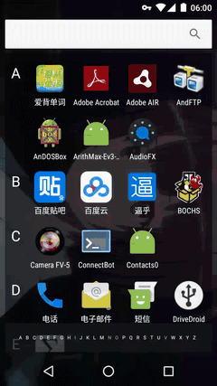
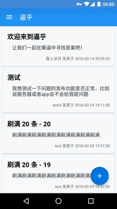
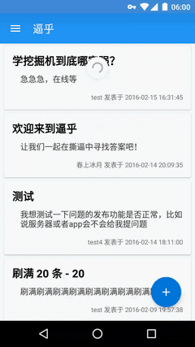
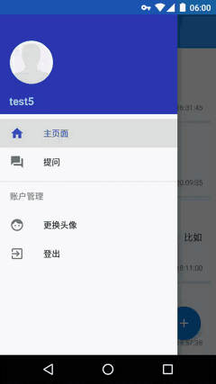

# 逼乎    
    
~~让我们在撕逼中寻找答案~~    

## 描述    
那句宣传语无视就好    
这是红岩安卓[2016寒假作业大礼包](https://github.com/Jude95/2016WinterHomeWork.git)的实现，主要也就实现了列举的那些功能了，比如登录登出，提交问题，提交答案，换头像~~（想了想似乎也就这么点）~~    
服务器使用的是[阿里云学生优惠](http://www.aliyun.com/act/aliyun/campus.html)，图片存储使用的是[阿里百川的免费容器试用](http://tae.taobao.com/appenginecreate)~~（羊毛该薅就薅）~~    
Web端使用的是朱大的[know_web](https://github.com/Jude95/know_web.git)的[修改版](https://github.com/haruue/know_web.git)，增加了安全性与图片上传功能，所以。。。就算是个 Level4 吧！    

## 功能    
+ 登录、登出    
    

+ 查看、提交问题    
    

+ 查看、提交答案    
    

+ 更换头像    
    
    

## 下载
+ [下载1.1.3版](app/app-release.apk?raw=true)

## 开发者
Haruue Icymoon <haruue@caoyue.com.cn>    
本项目作为红岩移动开发部寒假作业 Level3 和 Level4 部分    

## 开源    
Apache License 2.0    
``` License
Copyright [2016] [Haruue Icymoon]

Licensed under the Apache License, Version 2.0 (the "License");
you may not use this file except in compliance with the License.
You may obtain a copy of the License at

    http://www.apache.org/licenses/LICENSE-2.0

Unless required by applicable law or agreed to in writing, software
distributed under the License is distributed on an "AS IS" BASIS,
WITHOUT WARRANTIES OR CONDITIONS OF ANY KIND, either express or implied.
See the License for the specific language governing permissions and
limitations under the License.

```